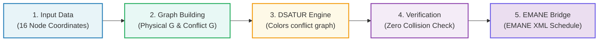

# TDMA Network Schedule Planner & Optimizer

**Vaan Megam Networks (VMN) — Wireless Protocol Development Internship Task**

---

## Presenter & Project Metadata
* **Student Name:** Kamal Vigneshwaraa S
* **Department:** Information Technology
* **College:** Sri Sairam Institute of Technology, Chennai
* **Domain:** Wireless Protocol Development & Graph Optimization

---

## Problem Overview & Wireless Concepts

In a **Time Division Multiple Access (TDMA)** wireless network, radio nodes share the same frequency channel by taking turns in designated **time-slots**. If two nearby radios transmit at the same time, their signals overlap and cause interference, destroying transmitted data packets.

To guarantee **100% collision-free transmission** while maximizing network capacity, our software brain solves two critical interference challenges:

```mermaid
graph TD
    subgraph "Interference Scenarios & Spatial Reuse"
    A["Node A"] <-->|Distance-1: Direct Link (<=500m)| B["Node B"]
    A2["Node A"] -->|Distance-2: Hidden Terminal| B2["Node B (Receiver)"]
    C2["Node C"] -->|Distance-2: Hidden Terminal| B2
    A3["Node A"] -.-|Distance > 2 Hops (Spatial Reuse)| D3["Node D"]
    end
    
    style A fill:#ff6b6b,stroke:#c0392b,stroke-width:2px,color:#fff
    style B fill:#ff6b6b,stroke:#c0392b,stroke-width:2px,color:#fff
    style A2 fill:#f39c12,stroke:#d35400,stroke-width:2px,color:#fff
    style C2 fill:#f39c12,stroke:#d35400,stroke-width:2px,color:#fff
    style B2 fill:#e74c3c,stroke:#c0392b,stroke-width:2px,color:#fff
    style A3 fill:#2ecc71,stroke:#27ae60,stroke-width:2px,color:#fff
    style D3 fill:#2ecc71,stroke:#27ae60,stroke-width:2px,color:#fff
```

1. **Direct Link Interference (Distance-1):** Radios within direct transmission range ($\le 500$ meters) are 1-hop neighbors. They must be assigned different timeslots.
2. **Hidden Terminal Interference (Distance-2):** If Node A and Node C transmit to mutual neighbor Node B (Node A $\to$ Node B $\leftarrow$ Node C), their signals collide at receiver B. They are 2-hop neighbors through B and must have different timeslots.
3. **Spatial Reuse ($> 2$ Hops):** Radios separated by more than 2 hops cause zero interference at any common receiver. They can safely reuse the exact same timeslot, shortening total frame length and boosting overall network capacity!

---

## System Architecture Workflow



---

## Clean Project Files Directory

| File Name | Description |
| :--- | :--- |
| `1_TDMA_Network_Brain.py` | Part 1 Python engine for distance-2 graph coloring, spatial reuse heuristics & ASCII report matrix. |
| `2_EMANE_Integration_Bridge.py` | Part 2 bridge script generating native EMANE TDMA XML schedule profiles. |
| `3_Generate_Flowchart_Diagram.py` | Generates system processing flowchart diagram PNG. |
| `3_Generate_Visual_Diagrams.py` | Generates 16-node topology graph and TDMA schedule allocation timeline PNGs. |
| `4_Generate_Documentation_PDF.py` | ReportLab script producing the complete 5-page PDF report. |
| `5_Generate_Presentation_PPTX.py` | PowerPoint generator producing the 10-slide PPTX presentation. |
| `Node_Coordinates_Input.json` | Standardized 16-node 2D coordinates input JSON file. |
| `EMANE_TDMA_Schedule_Profile.xml` | Generated native EMANE XML schedule configuration file. |
| `TDMA_Schedule_Optimizer_Documentation.pdf` | Clean documentation PDF report. |
| `TDMA_Schedule_Optimizer_Presentation.pptx` | 10-Slide PowerPoint presentation file. |
| `Dockerfile` | Ubuntu 22.04 container configuration. |
| `docker-compose.yml` | Single-command container deployment orchestration file. |

---

## How to Run locally

```bash
# 1. Run Part 1 Network Brain Engine
python 1_TDMA_Network_Brain.py

# 2. Run Part 2 EMANE Integration Bridge
python 2_EMANE_Integration_Bridge.py

# 3. Generate Diagrams & Flowcharts
python 3_Generate_Flowchart_Diagram.py
python 3_Generate_Visual_Diagrams.py

# 4. Generate Documentation PDF & Presentation PPTX
python 4_Generate_Documentation_PDF.py
python 5_Generate_Presentation_PPTX.py

# 5. Run via Docker Compose
docker-compose up --build
```

---
*Created for Vaan Megam Networks (VMN) Wireless Protocol Development Internship Task.*
